# Charts/Products Architecture Analysis

**Exercise ID:** ArchitecturalQuality10

**Related Exercises:**

- [Climate Model Analysis][exercise2]
- [Mars Moons Application Core][exercise3]
- [Case Study PDF][case-study]

---

## Situation

Product1 originally used a Common Core containing both chart functionality and financial domain logic.
When Product2 was developed, it needed enhanced chart capabilities,
so the chart component was copied and modified (creating Charts2 and iChart2),
while still sharing the financial domain logic.
This resulted in duplicate chart code and a Common Core with mixed responsibilities.

---

## Violated Principles

### 1. SRP (Single Responsibility Principle)

**Definition:** A component should have only one reason to change.

**Violations:**

- Common Core contains both financial domain logic AND chart functionality - two unrelated responsibilities
- Changes to chart requirements force changes in the same component as financial calculations
- Violates cohesion: unrelated concerns packaged together

---

### 2. CCP (Common Closure Principle)

**Definition:** Classes that change together should be packaged together.

**Violations:**

- Charts and Charts2 were created from the same source but packaged separately
- Both change when chart requirements evolve,
  but changes must be duplicated
- Bug fixes in chart logic don't automatically propagate between the two copies
- High maintenance cost:
  every chart update requires touching two components

---

### 3. CRP (Common Reuse Principle)

**Definition:** Don't force clients to depend on things they don't use.

**Violations:**

- Product1 uses only Charts, not Charts2, but both may be in the Common Core
- Product2 uses only Charts2, not Charts, creating dead dependencies
- Deployment packages include unused code
- Increases coupling without benefit

---

### 4. OCP (Open-Closed Principle)

**Definition:** Software should be open for extension, closed for modification.

**Violations:**

- Common Core was directly modified to add chart functionality instead of extended
- Charts2 created by copying and modifying iChart instead of extending the abstraction
- Adding Product2 features required changing existing code rather than adding new modules

---

### 5. DIP (Dependency Inversion Principle)

**Definition:** High-level modules should depend on abstractions, not concretions.

**Violations:**

- A-Core1 depends directly on the concrete Charts implementation
- A-Core2 depends directly on the concrete Charts2 implementation
- No stable interface layer between application cores and chart implementations
- Cannot swap chart implementations without changing application code

---

### 6. SDP (Stable Dependencies Principle)

**Definition:** Depend in the direction of stability.

**Violations:**

- A-Core2 immediately depends on newly created Charts2 (unstable, changing rapidly)
- Stable application logic becomes unstable due to dependency on volatile chart enhancements
- Charts2 annotated as "massively enhanced" suggests high change rate

---

### 7. SAP (Stable Abstractions Principle)

**Definition:** Stable packages should be abstract.

**Violations:**

- iChart interface was forked into iChart2 when it should have been stable
- Interface changes indicate the abstraction was wrong or incomplete
- Copying interfaces propagates instability to all implementors

---

## Architecture Diagrams (C4 Component View)

### As-Is Architecture: Violated Principles

**What this diagram shows:**

This C4 Component diagram illustrates the problematic architecture where Product1 and Product2 share a Common Core that
contains both chart functionality and financial domain logic.
The diagram highlights the tight coupling and principle violations that make the system difficult to maintain and
evolve.

**Why this diagram exists:**

To visualize the architectural smells and principle violations identified in this exercise:
multiple responsibilities in one component (SRP),
duplicated chart code (CCP),
unstable dependencies (SDP),
and lack of abstraction (DIP/SAP).

**Principles illustrated:**

- **SRP Violation:** Common Core has two unrelated responsibilities (charts + financial logic)
- **CCP Violation:** Charts and Charts2 are maintained separately despite changing together
- **DIP Violation:** A-Core1 and A-Core2 depend on concrete implementations, not abstractions
- **SDP Violation:** A-Core2 depends on the volatile Charts2 component
- **SAP Violation:** iChart and iChart2 interfaces are duplicated instead of being stable abstractions

**Arrow Legend:**

- **Dark Blue solid arrows** → Normal dependencies (required code flow)
- **Orange dashed arrows** → Violations highlighted (architectural problems)

```mermaid
%%{init: {'theme':'base', 'themeVariables': { 'primaryColor':'#e3f2fd','primaryTextColor':'#0d47a1','primaryBorderColor':'#1976d2','lineColor':'#1565C0','secondaryColor':'#fff3e0','tertiaryColor':'#f3e5f5', 'fontSize':'18px', 'edgeLabelBackground':'#ffffff'}}}%%
graph TB
    subgraph product1["📦 PRODUCT 1"]
        ACore1["<b>🔷 A-Core1</b><br/><br/>Application Core<br/><br/>Stable application logic<br/>stable"]
    end

    subgraph product2["📦 PRODUCT 2"]
        ACore2["<b>🔷 A-Core2</b><br/><br/>Application Core<br/><br/>Stable application logic<br/>stable"]
    end

    subgraph commoncore["⚙️ COMMON CORE"]
        Charts["<b>🟡 Charts</b><br/><br/>Chart Component<br/><br/>Original chart implementation<br/>moderate"]
        Charts2["<b>🔴 Charts2</b><br/><br/>Chart Component<br/><br/>DUPLICATED & massively enhanced<br/>volatile"]
        Financial["<b>🔷 Financial Logic</b><br/><br/>Domain Logic<br/><br/>Shared domain calculations<br/>stable"]
        iChart["<b>⚪ iChart</b><br/><br/>Interface<br/><br/>Chart interface<br/>unstable"]
        iChart2["<b>⚪ iChart2</b><br/><br/>Interface<br/><br/>FORKED interface<br/>unstable"]
    end

    Legend["<b>📋 ARROW LEGEND</b><br/><br/>━━ Dark Blue solid<br/>→ Normal dependencies<br/><br/>╌╌ Orange dashed<br/>→ Violations"]

    ACore1 -->|depends on<br/>concrete impl| Charts
    ACore2 -->|depends on<br/>concrete impl| Charts2
    Charts -->|implements| iChart
    Charts2 -->|implements| iChart2
    ACore1 -->|uses| Financial
    ACore2 -->|uses| Financial

    ViolationsNote["<b>⚠️ ARCHITECTURAL VIOLATIONS</b><br/><br/>• SRP: Mixed responsibilities<br/>• CCP: Duplicated chart code<br/>• CRP: Unused dependencies<br/>• OCP: Modified instead of extended<br/>• DIP: No stable abstractions<br/>• SDP: Stable → Volatile dependency<br/>• SAP: Forked interfaces"]
    Charts2Note["<b>⚠️ SDP VIOLATION</b><br/><br/>A-Core2 (stable) depends on<br/>highly volatile Charts2<br/><br/>Forces stable component<br/>to change frequently"]

    commoncore -.-> ViolationsNote
    Charts2 -.-> Charts2Note

    style ACore1 fill:#85BBF0,stroke:#1976d2,stroke-width:3px,color:#000
    style ACore2 fill:#85BBF0,stroke:#1976d2,stroke-width:3px,color:#000
    style Charts fill:#FFE082,stroke:#F57C00,stroke-width:3px,color:#000
    style Charts2 fill:#FFCDD2,stroke:#C62828,stroke-width:3px,color:#000
    style Financial fill:#85BBF0,stroke:#1976d2,stroke-width:3px,color:#000
    style iChart fill:#E0E0E0,stroke:#757575,stroke-width:3px,color:#000
    style iChart2 fill:#E0E0E0,stroke:#757575,stroke-width:3px,color:#000
    style ViolationsNote fill:#FFF9C4,stroke:#F57F17,stroke-width:3px,color:#000
    style Charts2Note fill:#FFF9C4,stroke:#F57F17,stroke-width:3px,color:#000
    style Legend fill:#E8F5E9,stroke:#2e7d32,stroke-width:3px,color:#000

    linkStyle 0 stroke:#0D47A1,stroke-width:4px
    linkStyle 1 stroke:#0D47A1,stroke-width:4px
    linkStyle 2 stroke:#0D47A1,stroke-width:4px
    linkStyle 3 stroke:#0D47A1,stroke-width:4px
    linkStyle 4 stroke:#0D47A1,stroke-width:4px
    linkStyle 5 stroke:#0D47A1,stroke-width:4px
    linkStyle 6 stroke:#FF8C00,stroke-width:4px,stroke-dasharray:5
    linkStyle 7 stroke:#FF8C00,stroke-width:4px,stroke-dasharray:5
```

### Refactored Architecture: Clean Separation

**What this diagram shows:**

This C4 Component diagram presents the recommended architecture that fixes all identified principle violations.
The refactored design separates concerns,
introduces stable abstractions,
and allows products to evolve independently.

**Why this diagram exists:**

To demonstrate how applying SOLID and component cohesion principles resolves the architectural issues.
This architecture supports independent evolution of chart implementations while maintaining shared financial domain
logic.

**Principles illustrated:**

- **SRP:** Each component has single responsibility (financial logic separate from charts)
- **CCP:** Related changes are packaged together (each product has its own chart implementation)
- **DIP:** A-Cores depend on stable `IChartRenderer` abstraction
- **SDP:** Dependencies flow toward stability (volatile implementations depend on stable interface)
- **SAP:** Stable `IChartRenderer` interface supports multiple implementations
- **OCP:** New chart features are extensions, not modifications

**Arrow Legend:**

- **Dark Blue solid arrows** → Normal dependencies (required code flow)
- **Green dashed arrows** → Stable interface implementations (abstraction layer)

```mermaid
%%{init: {'theme':'base', 'themeVariables': { 'primaryColor':'#e3f2fd','primaryTextColor':'#0d47a1','primaryBorderColor':'#1976d2','lineColor':'#1565C0','secondaryColor':'#fff3e0','tertiaryColor':'#f3e5f5', 'fontSize':'18px', 'edgeLabelBackground':'#ffffff'}}}%%
graph TB
    subgraph product1["📦 PRODUCT 1"]
        ACore1["<b>🔷 A-Core1</b><br/><br/>Application Core<br/><br/>Application logic<br/>stable"]
        BasicChart["<b>🟡 BasicChartRenderer</b><br/><br/>Chart Implementation<br/><br/>Product1-specific charts<br/>moderate"]
    end

    subgraph product2["📦 PRODUCT 2"]
        ACore2["<b>🔷 A-Core2</b><br/><br/>Application Core<br/><br/>Application logic<br/>stable"]
        EnhancedChart["<b>🟡 EnhancedChartRenderer</b><br/><br/>Chart Implementation<br/><br/>Product2-specific charts<br/>moderate"]
    end

    subgraph shared["🌐 SHARED DOMAIN"]
        Financial["<b>🔷 Financial Domain</b><br/><br/>Domain Logic<br/><br/>Shared calculations<br/>stable"]
        IChartRenderer["<b>🟢 IChartRenderer</b><br/><br/>Interface<br/><br/>Stable chart abstraction<br/>stable"]
    end

    ACore1 -->|depends on<br/>abstraction| IChartRenderer
    ACore2 -->|depends on<br/>abstraction| IChartRenderer
    BasicChart -->|implements| IChartRenderer
    EnhancedChart -->|implements| IChartRenderer
    ACore1 -->|uses| Financial
    ACore2 -->|uses| Financial
    ACore1 -->|configures| BasicChart
    ACore2 -->|configures| EnhancedChart

    BenefitsNote["<b>✅ ARCHITECTURAL BENEFITS</b><br/><br/>• SRP: Single responsibilities<br/>• CCP: Changes packaged together<br/>• DIP: Depend on abstractions<br/>• SDP: Stable dependencies<br/>• SAP: Stable interface<br/>• OCP: Extensible design"]
    AbstractionNote["<b>✅ STABLE ABSTRACTION</b><br/><br/>One interface supports<br/>multiple implementations<br/><br/>Products can evolve independently<br/>while sharing domain logic<br/>(DIP + SAP principles)"]

    shared -.-> BenefitsNote
    IChartRenderer -.-> AbstractionNote

    style ACore1 fill:#85BBF0,stroke:#1976d2,stroke-width:3px,color:#000
    style ACore2 fill:#85BBF0,stroke:#1976d2,stroke-width:3px,color:#000
    style BasicChart fill:#FFE082,stroke:#F57C00,stroke-width:3px,color:#000
    style EnhancedChart fill:#FFE082,stroke:#F57C00,stroke-width:3px,color:#000
    style Financial fill:#85BBF0,stroke:#1976d2,stroke-width:3px,color:#000
    style IChartRenderer fill:#A5D6A7,stroke:#2e7d32,stroke-width:3px,color:#000
    style BenefitsNote fill:#C8E6C9,stroke:#2e7d32,stroke-width:3px,color:#000
    style AbstractionNote fill:#C8E6C9,stroke:#2e7d32,stroke-width:3px,color:#000

    linkStyle 0 stroke:#0D47A1,stroke-width:4px
    linkStyle 1 stroke:#0D47A1,stroke-width:4px
    linkStyle 2 stroke:#0D47A1,stroke-width:4px
    linkStyle 3 stroke:#0D47A1,stroke-width:4px
    linkStyle 4 stroke:#0D47A1,stroke-width:4px
    linkStyle 5 stroke:#0D47A1,stroke-width:4px
    linkStyle 6 stroke:#0D47A1,stroke-width:4px
    linkStyle 7 stroke:#0D47A1,stroke-width:4px
    linkStyle 8 stroke:#2e7d32,stroke-width:3px,stroke-dasharray:5
    linkStyle 9 stroke:#2e7d32,stroke-width:3px,stroke-dasharray:5
```

---

## Recommended Fixes

1. **Extract stable interface:**
   `IChartRenderer` that both Products depend on
2. **Separate implementations:**
   BasicChartRenderer (Product1), EnhancedChartRenderer (Product2)
3. **Separate domains:**
   Move financial logic to separate component, independent of charts
4. **Dependency inversion:**
   A-Cores depend on `IChartRenderer`, implementations are pluggable

**Result:**
Products share financial domain,
use different chart implementations via common interface,
can evolve independently.

---

## Glossary

| Term            | Definition                                                                                        |
|-----------------|---------------------------------------------------------------------------------------------------|
| **[SRP][srp]**  | Single Responsibility Principle: A component should have only one reason to change                |
| **[CCP][ccp]**  | Common Closure Principle: Classes that change together should be packaged together                |
| **[CRP][crp]**  | Common Reuse Principle: Don't force clients to depend on things they don't use                    |
| **[OCP][ocp]**  | Open-Closed Principle: Software should be open for extension, closed for modification             |
| **[DIP][dip]**  | Dependency Inversion Principle: High-level modules should depend on abstractions, not concretions |
| **[SDP][sdp]**  | Stable Dependencies Principle: Depend in the direction of stability                               |
| **[SAP][sap]**  | Stable Abstractions Principle: Stable packages should be abstract                                 |
| **A-Core**      | Application Core: Domain logic component                                                          |
| **Common Core** | Shared component containing both domain logic and chart functionality (architectural smell)       |

---

<!-- Reference Links -->

[exercise2]: ../08-climate-model-architecture-analysis/climate-model-analysis.md

[exercise3]: ../../Evening%203%20-%20Architecture%20Development/03-mars-application-core/README.md

[case-study]: ../../Evening%203%20-%20Architecture%20Development/03-mars-application-core/slides/03-mars-moons-application-core.pdf

<!-- Principle Links -->

[srp]: #1-srp-single-responsibility-principle

[ccp]: #2-ccp-common-closure-principle

[crp]: #3-crp-common-reuse-principle

[ocp]: #4-ocp-open-closed-principle

[dip]: #5-dip-dependency-inversion-principle

[sdp]: #6-sdp-stable-dependencies-principle

[sap]: #7-sap-stable-abstractions-principle
