# EarlyBird Application Core Architecture

**Purpose:** Separate stable business logic from volatile technology concerns
**Exercise ID:** EarlyBird12

---

## Glossary

| Term                      | Definition                                                                               |
|---------------------------|------------------------------------------------------------------------------------------|
| **Application Core**      | Stable business logic layer containing domain entities and services                      |
| **Adapter**               | Technology-specific implementation connecting core to external systems (DB, web, SMS)    |
| **Stable Requirements**   | Business rules that remain constant regardless of technology (pricing, orders, products) |
| **Volatile Requirements** | Technology concerns that change frequently (UI frameworks, payment APIs, databases)      |
| **Dependency Direction**  | Adapters depend on core (inward), never the reverse (outward independence)               |
| **Change Impact**         | Analysis of which components require modification when new requirements arrive           |

---

The EarlyBird breakfast delivery system architecture separates stable business
logic from volatile technology concerns.
This document presents the application core design, key workflows,
and change impact analysis for common evolution scenarios.

---

## 1. Requirements Classification

Requirements are classified by stability:
**Stable requirements** (core business rules like products, orders, customers,
authentication, pricing, cancellation rules) remain constant regardless of technology.
**Unstable requirements** (delivery channels like phone/web/SMS,
payment integrations, label printing) change frequently with technology evolution.

The architecture isolates stable business logic in the application core
from volatile technology concerns in adapters.

---

## 2. Application Core Components

### Core Services

| Component            | Responsibility                | Key Methods                                    |
|----------------------|-------------------------------|------------------------------------------------|
| **OrderService**     | Place, cancel, query orders   | `placeOrder()`, `cancelOrder()`, `getStatus()` |
| **ProductCatalog**   | Search and retrieve products  | `searchByCharacteristics()`, `findByCode()`    |
| **CustomerRegistry** | Authenticate customers        | `authenticate()`, `isBlacklisted()`            |
| **InvoiceGenerator** | Generate invoices from orders | `generateInvoice()`                            |
| **DeliveryPlanner**  | Plan optimal delivery routes  | `planRoute()`, `optimizeRoute()`               |

### Domain Entities

| Entity            | Description                   | Key Attributes                                     |
|-------------------|-------------------------------|----------------------------------------------------|
| **Order**         | Shopping cart with line items | Order number, customer, status, order lines, total |
| **Product**       | Simple or prepackaged product | Code, name, price, calories                        |
| **Customer**      | Person placing orders         | Customer number (XX-XXXXXXX-C), name, address      |
| **Invoice**       | Bill for completed order      | Invoice number, order reference, total amount      |
| **DeliveryRoute** | Optimized delivery itinerary  | Stops, total distance, estimated duration          |

**Key domain concepts:**

- **Order lines** store price snapshots to preserve order total
  when product prices change later
- **Prepackaged products** contain other products (composite pattern)
- **Order status** transitions: Placed → Packed → Out for Delivery → Delivered
  (cancellation only when Placed)

---

## 3. Order Submission Workflow

### 3.1 Data exchanged (in order)

1. **Customer → WebUI**: sends `{customerNumber, password, productCodes + quantities[,
   optional blueprintOrderId]}`.
2. **WebUI → CustomerRegistry**: sends credentials;
   gets back either an authenticated `Customer` or an authentication error.
3. **WebUI → ProductCatalog**: for each product code,
   retrieves a full `Product` (price, calories, etc.) from the core.
4. **WebUI → OrderService**: sends the `Customer`
   plus the list of `(Product, quantity)` (and optionally a `blueprintOrderId`).
5. **OrderService → DatabaseRepository**: loads a blueprint `Order` if requested
   and asks for a new `orderNumber`.
6. **OrderService → DatabaseRepository**: saves the new `Order`
   with snapshotted prices and status `Placed`.
7. **OrderService → WebUI → Customer**: returns `{orderNumber, total, status=Placed}`
   as order confirmation.

> The same `OrderService.placeOrder` is used by both the web and SMS adapters;
> only the input parsing in the adapters differs.

---

## 4. Container Architecture (C4 Model - Level 2)

> **C4 Container Diagram** shows the high-level technology choices and deployable units.
> This is the preferred visualization for understanding system architecture at the deployment level.

```mermaid
%%{init: {'theme':'base', 'themeVariables': { 'primaryColor':'#e3f2fd','primaryTextColor':'#0d47a1','primaryBorderColor':'#1976d2','lineColor':'#42a5f5','secondaryColor':'#fff3e0','tertiaryColor':'#f3e5f5'}}}%%
graph TB
    subgraph actors["👥 External Actors"]
        Customer([Customer<br/>Orders breakfast<br/>via web or SMS])
        Admin([Administrator<br/>Manages products<br/>and customers])
        Clerk([Packing Clerk<br/>Prepares orders<br/>for delivery])
    end

    subgraph earlybird["🏢 EarlyBird System"]
        subgraph containers["Deployable Containers"]
            WebApp["📱 Web Application<br/>[ASP.NET Core MVC]<br/><br/>Provides web UI for<br/>customers and administrators"]
            API["🔌 API Service<br/>[ASP.NET Core Web API]<br/><br/>REST endpoints for<br/>mobile and SMS integration"]
            Core["⚙️ Application Core<br/>[.NET Class Library]<br/><br/>OrderService, ProductCatalog,<br/>CustomerRegistry, InvoiceGenerator,<br/>DeliveryPlanner"]
            DB[("💾 Database<br/>[PostgreSQL]<br/><br/>Stores orders, products,<br/>customers, invoices")]
            Cache[("⚡ Cache<br/>[Redis]<br/><br/>Product catalog<br/>and session data")]
        end
    end

    subgraph external["🌐 External Systems"]
        Payment["💳 Payment Gateway<br/><br/>Processes credit<br/>card payments"]
        SMS["📱 SMS Provider<br/><br/>Sends order<br/>confirmations"]
        Printer["🖨️ Label Printer API<br/><br/>Prints delivery<br/>address labels"]
    end

    %% User interactions
    Customer -->|HTTPS| WebApp
    Customer -->|HTTPS/SMS| API
    Admin -->|HTTPS| WebApp
    Clerk -->|HTTPS| WebApp

    %% Container interactions
    WebApp -->|In-process calls| Core
    API -->|In-process calls| Core

    %% Core to infrastructure
    Core -->|ADO.NET/Dapper| DB
    Core -->|StackExchange.Redis| Cache

    %% Core to external systems
    Core -->|HTTPS/REST| Payment
    Core -->|HTTPS/REST| SMS
    Core -->|HTTPS/REST| Printer

    style WebApp fill:#42a5f5,stroke:#1976d2,color:#fff,stroke-width:3px
    style API fill:#42a5f5,stroke:#1976d2,color:#fff,stroke-width:3px
    style Core fill:#1976d2,stroke:#0d47a1,color:#fff,stroke-width:4px
    style DB fill:#4caf50,stroke:#2e7d32,color:#fff,stroke-width:3px
    style Cache fill:#4caf50,stroke:#2e7d32,color:#fff,stroke-width:3px
    style Payment fill:#ff9800,stroke:#e65100,color:#fff,stroke-width:2px
    style SMS fill:#ff9800,stroke:#e65100,color:#fff,stroke-width:2px
    style Printer fill:#ff9800,stroke:#e65100,color:#fff,stroke-width:2px
    style Customer fill:#9c27b0,stroke:#6a1b9a,color:#fff
    style Admin fill:#9c27b0,stroke:#6a1b9a,color:#fff
    style Clerk fill:#9c27b0,stroke:#6a1b9a,color:#fff
```

**Diagram Legend:**

- 🔵 **Blue boxes** = Deployable containers (Web App, API Service)
- 🔷 **Dark blue box** = Application Core (shared library, not separately deployed)
- 🟢 **Green cylinders** = Data storage (Database, Cache)
- 🟠 **Orange boxes** = External systems (Payment, SMS, Printer)
- 🟣 **Purple circles** = External actors (Customer, Admin, Clerk)

### Key Architectural Decisions

**Container Boundaries:**

- **Web Application**: Customer-facing UI + admin dashboard (separately deployable)
- **API Service**: SMS integration + future mobile apps (separately deployable)
- **Application Core**: Shared business logic library (embedded in Web + API containers)
- **Database**: Persistent storage with ACID guarantees (PostgreSQL for JSONB support)
- **Cache**: Performance optimization layer (Redis for session + product catalog caching)

**Deployment Model:**

- Web Application: 3 instances (Azure App Service, load balanced)
- API Service: 2 instances (Azure App Service, auto-scaling enabled)
- Database: Azure Database for PostgreSQL (High Availability mode)
- Cache: Azure Cache for Redis (Standard tier)

**Communication Patterns:**

- Web/API → Core: In-process method calls (no network overhead)
- Core → Database: Synchronous ADO.NET via Dapper ORM
- Core → Cache: Asynchronous StackExchange.Redis client
- Core → External Systems: HTTPS REST APIs with circuit breaker pattern

**Technology Rationale:**

- **PostgreSQL**: Chosen for JSONB support (flexible product attributes), mature ecosystem, team expertise
- **Redis**: High-performance caching, sub-millisecond latency for product lookups
- **ASP.NET Core**: Cross-platform, high throughput, native dependency injection
- **.NET Class Library**: Application Core is framework-agnostic, can be reused in desktop/CLI tools

---

### 4.1 Component-Level View (Application Core Internals)

For detailed view of components *inside* the Application Core container:

**Core Services:**

- `OrderService` - Place, cancel, query orders
- `ProductCatalog` - Search and retrieve products
- `CustomerRegistry` - Authenticate customers
- `InvoiceGenerator` - Generate invoices from orders
- `DeliveryPlanner` - Plan optimal delivery routes

**Domain Entities:**

- `Order` (with `OrderLine` items)
- `Product` (simple or prepackaged)
- `Customer` (with authentication credentials)
- `Invoice` (billing records)
- `DeliveryRoute` (optimized stops)

**Interfaces (Dependency Inversion):**

- `IOrderRepository`, `IProductRepository`, `ICustomerRepository` (implemented by Database adapter)
- `IPaymentGateway` (implemented by Payment adapter)
- `ISmsProvider` (implemented by SMS adapter)

**Dependency Direction:** All adapters (Web, API, Database, Payment, SMS) depend on the Application Core.
The core depends only on abstractions (interfaces), never on concrete adapter implementations.

---

## 5. Change Impact Analysis

### Scenario A: Standing Orders

**Requirement:** "Standing orders (e.g. coffee every Sunday) should be possible."

**Impact:**

| Component                      | Change Type     | Details                                     |
|--------------------------------|-----------------|---------------------------------------------|
| **StandingOrder**              | New entity      | Stores recurrence pattern (weekly, monthly) |
| **StandingOrderService**       | New service     | Create, cancel, execute standing orders     |
| **OrderService**               | Minor extension | Add `placeStandingOrder()` method           |
| **WebStandingOrderController** | New adapter     | Handle standing order requests              |
| **Scheduler**                  | New adapter     | Trigger standing orders at scheduled times  |
| Existing features              | No impact       | Regular orders, packing, delivery unchanged |

**Key insight:** Extension via new components, not modification of existing ones.

---

### Scenario B: All-Day Meals

**Requirement:** "Deliver all meals (lunch, dinner) not just breakfast."

**Impact:**

| Component                | Change Type  | Details                                            |
|--------------------------|--------------|----------------------------------------------------|
| **Product**              | Extension    | Add `mealType` property (Breakfast, Lunch, Dinner) |
| **ProductCatalog**       | Extension    | Add `searchByMealType()` filter                    |
| **Order**                | No impact    | Order logic independent of meal type               |
| **OrderService**         | No impact    | Order placement unchanged                          |
| **WebProductController** | Minor update | Add meal type filter to UI                         |

**Key insight:** Product classification change has minimal impact - core order logic remains untouched.

---

### Scenario C: Delivery Tracking

**Requirement:** "Customers should track deliveries online."

**Impact:**

| Component                   | Change Type | Details                                   |
|-----------------------------|-------------|-------------------------------------------|
| **DeliveryRoute**           | Extension   | Add `currentLocation`, `estimatedArrival` |
| **Order**                   | Extension   | Add `deliveryProgress` property           |
| **DeliveryTrackingService** | New service | Provide tracking status                   |
| **WebTrackingController**   | New adapter | Public tracking endpoint                  |
| **DeliveryClerkMobileApp**  | New adapter | Update GPS location periodically          |
| **OrderService**            | No impact   | Order placement unchanged                 |

**Key insight:** Tracking is a new feature layer - doesn't affect existing workflows.

---

## See Also

- [Example O-Interface design](../../Evening 2 - Architectural Quality/02-isearchproduct-interface-specification/isearchproduct-interface.md)
- [earlybird-requirements-v150.pdf](earlybird-requirements-v150.pdf) - Complete domain requirements
