# arc42 Chapter 10: Quality Requirements

## Purpose

This chapter specifies **measurable quality requirements** using a quality tree and concrete scenarios with quantified success criteria.

---

## Table of Contents

- [Quality Tree](#quality-tree)
- [Quality Scenarios](#quality-scenarios)
  - [Maintainability Scenarios](#maintainability-scenarios)
  - [Correctness Scenarios](#correctness-scenarios)
  - [Performance Scenarios](#performance-scenarios)
- [Quality Metrics Summary](#quality-metrics-summary)
- [Non-Functional Requirements](#non-functional-requirements)
- [Trade-Off Analysis](#trade-off-analysis)

---

## Quality Tree

```mermaid
graph TD
    Root[MateMate Quality Goals]

    Root --> Maintainability
    Root --> Correctness
    Root --> Performance

    Maintainability --> ArchClar[Architectural Clarity]
    Maintainability --> ChangeIso[Change Isolation]
    Maintainability --> TestCov[Test Coverage]

    ArchClar --> BloodType[Blood Type Enforcement]
    ArchClar --> DepControl[Dependency Control]
    ChangeIso --> ImpactLimit[Limited Blast Radius]
    ChangeIso --> TechIndep[Technology Independence]
    TestCov --> UnitTest[Unit Test Coverage >=80%]
    TestCov --> IntTest[Integration Tests]

    Correctness --> RuleComp[FIDE Compliance]
    Correctness --> StateInteg[State Integrity]

    RuleComp --> MoveVal[Move Validation]
    RuleComp --> CheckDet[Check/Checkmate Detection]
    StateInteg --> Immutable[Immutable History]
    StateInteg --> ValidState[Always Valid Position]

    Performance --> Responsive[Responsiveness]
    Performance --> Efficiency[Resource Efficiency]

    Responsive --> MoveLatency[Move Latency < 100ms]
    Responsive --> FrameRate[60 FPS Rendering]
    Efficiency --> CPUUsage[CPU < 20% Idle]
    Efficiency --> MemUsage[Memory < 200 MB]

    classDef high fill:#90EE90,stroke:#333,stroke-width:2px,color:#000
    classDef medium fill:#FFD700,stroke:#333,stroke-width:2px,color:#000
    classDef low fill:#87CEEB,stroke:#333,stroke-width:2px,color:#000

    class Maintainability,Correctness high
    class Performance medium
    class ArchClar,RuleComp,Responsive high
    class ChangeIso,StateInteg,Efficiency medium
    class TestCov low
```

### Priority Legend

| Priority | Color  | Description                     |
|----------|--------|---------------------------------|
| High     | Green  | Critical to project success     |
| Medium   | Yellow | Important but not blocking      |
| Low      | Blue   | Nice to have                    |

---

## Quality Scenarios

### Maintainability Scenarios

<b>Scenario M1: New Developer Onboarding</b>

**Goal:** New developer understands architecture quickly

**Scenario:**

| Aspect      | Description                                            |
|-------------|--------------------------------------------------------|
| Context     | New developer (no prior MateMate knowledge)            |
| Stimulus    | Read architecture documentation                        |
| Environment | Documentation from this repository                     |
| Response    | Developer can explain 5 subsystems and responsibilities|
| Measure     | 15 minutes to achieve understanding                    |

**Success Criteria:**

| # | Criterion                                          | Status |
|---|----------------------------------------------------|--------|
| 1 | Developer can draw K1-K5 dependency graph          | Target |
| 2 | Developer can explain blood type (T/A/0)           | Target |
| 3 | Developer can name 3 forbidden dependencies        | Target |

**Design Validation:**

| Metric          | Target     | Status           |
|-----------------|------------|------------------|
| Comprehension   | 15 min     | Not yet measured |

---

<b>Scenario M2: Renderer Technology Swap</b>

**Goal:** Replace rendering engine with minimal impact

**Scenario:**

| Aspect      | Description                                             |
|-------------|---------------------------------------------------------|
| Context     | MateMate 1.0 uses custom 2D renderer (K2)               |
| Stimulus    | Replace K2 with GPU-accelerated renderer (e.g., Skia)   |
| Environment | Production codebase                                     |
| Response    | New renderer integrated without changing chess logic    |
| Measure     | 80 hours of work, 2 subsystems changed                  |

**Expected Impact:**

| Subsystem | Changes Required       | Estimated Effort |
|-----------|------------------------|------------------|
| K1        | None                   | 0h               |
| **K2**    | Complete rewrite       | 60h              |
| **K3**    | Update render API calls| 20h              |
| K4        | None                   | 0h               |
| K5        | None                   | 0h               |

**Success Criteria:**

| # | Criterion                                    | Status |
|---|----------------------------------------------|--------|
| 1 | Only K2 and K3 modified                      | Target |
| 2 | K4 and K5 untouched (chess logic independent)| Target |
| 3 | All tests pass after swap                    | Target |

**Verification:**

| Metric          | Prediction                          | Status    |
|-----------------|-------------------------------------|-----------|
| Change Impact   | K2 (high), K3 (medium), others none | Predicted |

---

<b>Scenario M3: Add Chess Variant (Chess960)</b>

**Goal:** Support Fischer Random Chess with minimal changes

**Scenario:**

| Aspect      | Description                                         |
|-------------|-----------------------------------------------------|
| Context     | MateMate supports standard chess only               |
| Stimulus    | Add Chess960 (randomized starting position)         |
| Environment | Production codebase                                 |
| Response    | Chess960 supported without breaking standard chess  |
| Measure     | 16 hours of work, 2 subsystems changed              |

**Expected Impact:**

| Subsystem | Changes Required                    | Estimated Effort |
|-----------|-------------------------------------|------------------|
| K1        | None                                | 0h               |
| K2        | None                                | 0h               |
| K3        | Add game mode selection UI          | 4h               |
| **K4**    | Update castling validation          | 8h               |
| **K5**    | Store starting position in history  | 4h               |

**Success Criteria:**

| # | Criterion                              | Status |
|---|----------------------------------------|--------|
| 1 | Standard chess still works             | Target |
| 2 | Only K3, K4, K5 modified               | Target |
| 3 | Blood type separation maintained       | Target |

---

### Correctness Scenarios

<b>Scenario C1: Illegal Move Rejection</b>

**Goal:** 100% illegal moves rejected

**Scenario:**

| Aspect      | Description                                      |
|-------------|--------------------------------------------------|
| Context     | MateMate in active game                          |
| Stimulus    | Player attempts illegal move (e.g., pawn backward)|
| Environment | Any board position                               |
| Response    | Move rejected immediately, board unchanged       |
| Measure     | 100% rejection rate (0 false negatives)          |

**Test Cases:**

| ID   | Illegal Move           | Expected |
|------|------------------------|----------|
| C1.1 | Pawn backward          | Rejected |
| C1.2 | Knight 3 squares       | Rejected |
| C1.3 | King into check        | Rejected |
| C1.4 | Castle through check   | Rejected |
| C1.5 | Move pinned piece      | Rejected |
| C1.6 | Move after checkmate   | Rejected |

**Design Validation:**

| Metric           | Target | Status             |
|------------------|--------|--------------------|
| Rejection Rate   | 100%   | Design requirement |
| Planned Tests    | ~150+  | K4 unit tests      |

---

<b>Scenario C2: Checkmate Detection</b>

**Goal:** Correctly detect checkmate in all positions

**Scenario:**

| Aspect      | Description                                    |
|-------------|------------------------------------------------|
| Context     | MateMate in endgame position                   |
| Stimulus    | Player delivers checkmate (e.g., back-rank)    |
| Environment | Any checkmate position                         |
| Response    | Game declared over, winner announced           |
| Measure     | 100% detection rate (0 false negatives)        |

**Test Positions:**

| ID   | Position             | Expected           |
|------|----------------------|--------------------|
| C2.1 | Back-rank mate       | Checkmate detected |
| C2.2 | Smothered mate       | Checkmate detected |
| C2.3 | Queen + King vs King | Checkmate detected |
| C2.4 | Check (not mate)     | Game continues     |
| C2.5 | Stalemate            | Draw, not checkmate|

**Design Validation:**

| Metric           | Target | Status             |
|------------------|--------|--------------------|
| Detection Rate   | 100%   | Design requirement |
| Planned Tests    | ~40+   | Mate patterns      |

---

<b>Scenario C3: State Integrity After Undo</b>

**Goal:** Undo restores exact previous position

**Scenario:**

| Aspect      | Description                              |
|-------------|------------------------------------------|
| Context     | MateMate after 10 moves                  |
| Stimulus    | Player clicks "Undo" 5 times             |
| Environment | Any game state                           |
| Response    | Position reverts to move 5 exactly       |
| Measure     | 100% match (FEN comparison)              |

**Success Criteria:**

| # | Criterion                        | Status |
|---|----------------------------------|--------|
| 1 | FEN string matches expected      | Target |
| 2 | Castling rights restored         | Target |
| 3 | En passant target restored       | Target |
| 4 | Halfmove clock restored          | Target |

**Design Validation:**

| Metric           | Target | Status             |
|------------------|--------|--------------------|
| Position Match   | 100%   | Design requirement |
| Planned Tests    | ~15-20 | K5 integration     |

---

### Performance Scenarios

<b>Scenario P1: Move Execution Latency</b>

**Goal:** Responsive move execution

**Scenario:**

| Aspect      | Description                              |
|-------------|------------------------------------------|
| Context     | MateMate during active game              |
| Stimulus    | Player drags piece to new square         |
| Environment | Mid-game position (20 pieces on board)   |
| Response    | Move executes and board re-renders       |
| Measure     | P95 latency 100ms                        |

**Latency Breakdown:**

| Operation         | P50   | P95   | Budget |
|-------------------|-------|-------|--------|
| Input capture     | 2ms   | 5ms   | 10ms   |
| Legal move calc   | 15ms  | 40ms  | 50ms   |
| Move validation   | 3ms   | 8ms   | 10ms   |
| Position update   | 5ms   | 12ms  | 15ms   |
| Board rendering   | 12ms  | 18ms  | 20ms   |
| **Total**         | 37ms  | 83ms  | 100ms  |

**Design Validation:**

| Metric      | Target   | Status           |
|-------------|----------|------------------|
| P95 Latency | 100ms    | Design target    |
| Headroom    | 17ms     | 17% buffer       |

---

<b>Scenario P2: Checkmate Detection Performance</b>

**Goal:** Fast endgame checkmate detection

**Scenario:**

| Aspect      | Description                              |
|-------------|------------------------------------------|
| Context     | MateMate in endgame (10 pieces)          |
| Stimulus    | Player delivers checkmate                |
| Environment | Typical endgame position                 |
| Response    | Checkmate detected and announced         |
| Measure     | P95 latency 300ms                        |

**Analysis Complexity:**

| Metric                   | Value          |
|--------------------------|----------------|
| Exhaustive search        | ~5,120 checks  |
| With alpha-beta pruning  | ~500 checks    |
| Reduction                | 90%            |

**Design Validation:**

| Metric      | Target   | Status           |
|-------------|----------|------------------|
| P95 Latency | 300ms    | Design target    |

---

<b>Scenario P3: Frame Rate During Animation</b>

**Goal:** Smooth rendering during piece movement

**Scenario:**

| Aspect      | Description                              |
|-------------|------------------------------------------|
| Context     | MateMate rendering board                 |
| Stimulus    | Player drags piece across board          |
| Environment | Continuous animation (30 frames)         |
| Response    | Smooth visual feedback                   |
| Measure     | 60 FPS (16.67ms per frame)               |

**Frame Timing:**

| Component            | Time per Frame |
|----------------------|----------------|
| K1: Input polling    | 0.5ms          |
| K2: Piece sprite draw| 8ms            |
| K2: Board draw       | 3ms            |
| K2: Buffer swap      | 1ms            |
| **Total**            | 12.5ms         |

**Headroom:** 16.67ms - 12.5ms = 4.17ms (25% buffer)

**Design Validation:**

| Metric      | Target   | Status           |
|-------------|----------|------------------|
| Frame Rate  | 60 FPS   | Design target    |
| Headroom    | 25%      | Sufficient       |

---

## Quality Metrics Summary

### Maintainability Metrics

| Metric                           | Target   | Current    | Status |
|----------------------------------|----------|------------|--------|
| Subsystem Count                  | 3-7      | 5          | Pass   |
| Avg Dependencies / Subsystem     | 5        | 3.6        | Pass   |
| Dependency Violations            | 0        | 0          | Pass   |
| Blood Type Compliance            | 100%     | 100%       | Pass   |
| Documentation Comprehension Time | 15 min   | -          | Target |

### Correctness Metrics

| Metric                       | Target | Current | Status |
|------------------------------|--------|---------|--------|
| Move Validation Accuracy     | 100%   | Design  | Pass   |
| Checkmate Detection Accuracy | 100%   | Design  | Pass   |
| State Integrity (Undo/Redo)  | 100%   | Design  | Pass   |
| Unit Test Coverage (K4)      | 80%    | -       | Target |
| Integration Test Coverage    | 60%    | -       | Target |

### Performance Metrics

| Metric                    | Target   | Current | Status |
|---------------------------|----------|---------|--------|
| Move Execution (P95)      | 100ms    | -       | Target |
| Checkmate Detection (P95) | 300ms    | -       | Target |
| Frame Rate (P99)          | 60 FPS   | -       | Target |
| CPU Usage (Idle)          | 5%       | -       | Target |
| Memory Footprint          | 200 MB   | -       | Target |

> [!NOTE]
> **Overall Score:** 15/15 metrics defined with clear targets

---

## Non-Functional Requirements

### Usability

| ID | Requirement                                        | Target    |
|----|----------------------------------------------------|-----------|
| U1 | New player can start game (no tutorial required)   | 30 sec    |
| U2 | Move feedback visible after input                  | 50ms      |
| U3 | Error messages clear and actionable                | -         |

### Reliability

| ID | Requirement                                        | Target    |
|----|----------------------------------------------------|-----------|
| R1 | Zero crashes during continuous games               | 100 games |
| R2 | Position integrity maintained across moves         | 1,000     |
| R3 | Graceful degradation if validation fails           | -         |

### Portability

| ID | Requirement                                        | Target    |
|----|----------------------------------------------------|-----------|
| P1 | Runs on Windows, macOS, Linux                      | .NET 10   |
| P2 | No external dependencies                           | Zero DLLs |
| P3 | Single executable deployment                       | -         |

### Maintainability

| ID | Requirement                                        | Target    |
|----|----------------------------------------------------|-----------|
| M1 | Codebase size                                      | 10,000 LOC|
| M2 | All public APIs documented                         | XML docs  |
| M3 | No circular dependencies                           | Enforced  |

---

## Trade-Off Analysis

<b>Maintainability vs Performance</b>

**Chosen:** Maintainability

| Aspect        | Simple Approach | Optimized Approach |
|---------------|-----------------|-------------------|
| Implementation| Simple move gen | Bitboards         |
| Latency (P50) | 15ms            | 2ms               |
| LOC Added     | 0               | ~500              |
| Readability   | High            | Low               |

**Rationale:**
- 15ms is well within 100ms budget (85ms headroom)
- Bitboards add ~500 LOC and reduce readability
- **Verdict:** Readability worth 13ms latency penalty

<b>Correctness vs Performance</b>

**Chosen:** Correctness

| Aspect           | Exhaustive     | Heuristic      |
|------------------|----------------|----------------|
| Implementation   | Full check     | Probabilistic  |
| Accuracy         | 100%           | ~99%           |
| Latency (P95)    | 300ms          | 50ms           |

**Rationale:**
- Checkmate detection is 100% accurate (no false positives/negatives)
- P95 latency target of 300ms acceptable for endgame (rare event)
- **Verdict:** Correctness prioritized over raw performance

<b>Simplicity vs Features</b>

**Chosen:** Simplicity

| Aspect         | With AI Opponent | Without AI |
|----------------|------------------|------------|
| LOC            | +2,000           | 0          |
| Complexity     | High             | Low        |
| In Requirements| No               | -          |

**Rationale:**
- Computer opponent requires search tree (adds ~2,000 LOC)
- Not in requirements
- **Verdict:** Simplicity worth sacrificing feature

---

## Quality Scenarios Verification Matrix

| ID | Scenario               | Target   | Status         |
|----|------------------------|----------|----------------|
| M1 | Onboarding time        | 15 min   | Not measured   |
| M2 | Renderer swap          | 80h      | Predicted      |
| M3 | Add Chess960           | 16h      | Predicted      |
| C1 | Illegal move rejection | 100%     | Design Pass    |
| C2 | Checkmate detection    | 100%     | Design Pass    |
| C3 | Undo integrity         | 100%     | Design Pass    |
| P1 | Move latency           | 100ms    | Not measured   |
| P2 | Checkmate latency      | 300ms    | Not measured   |
| P3 | Frame rate             | 60 FPS   | Not measured   |

> [!TIP]
> **Design Validation:** 9/9 scenarios have clear targets defined
