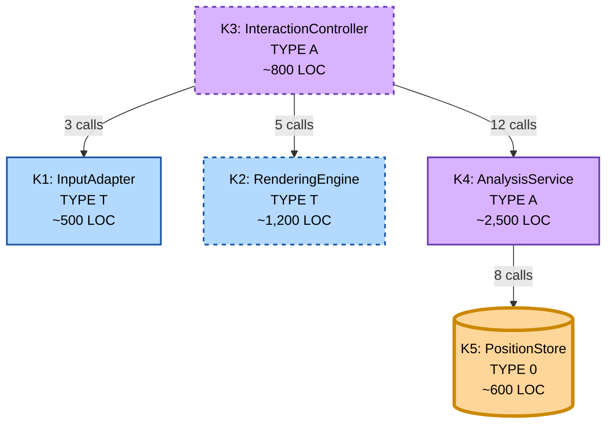

# MateMate Subsystems

## Overview

MateMate consists of **5 subsystems** (K1-K5) classified by **blood type** (T/A/0) based on their primary change driver.

---

## Table of Contents

- [Blood Type Classification](#blood-type-classification)
- [Subsystem Details](#subsystem-details)
  - [K1 InputAdapter](#k1-presentationinputadapter)
  - [K2 RenderingEngine](#k2-presentationrenderingengine)
  - [K3 InteractionController](#k3-applicationinteractioncontroller)
  - [K4 AnalysisService](#k4-domainanalysisservice)
  - [K5 PositionStore](#k5-corepositionstore)
- [Subsystem Comparison](#subsystem-comparison-table)
- [Dependency Graph](#dependency-graph)
- [Blood Type Rules](#blood-type-dependency-rules)
- [Change Scenarios](#change-scenarios-by-blood-type)

---

## Blood Type Classification

| Type | Name        | Change Driver                               | Color  |
|------|-------------|---------------------------------------------|--------|
| T    | Technical   | Technology evolves (OS APIs, graphics libs) | Blue   |
| A    | Application | Business rules evolve (game logic, UI)      | Purple |
| 0    | Core        | Rarely changes (universal concepts)         | Orange |

> [!IMPORTANT]
> Blood type indicates **WHY a subsystem changes**, not HOW OFTEN. A TYPE T subsystem can be very stable (e.g., mature SQL) or volatile (e.g., emerging framework).

---

## Subsystem Details

<b>K1 Presentation.InputAdapter</b>

### Overview

| Property       | Value                                      |
|----------------|--------------------------------------------|
| **Blood Type** | T (Technical)                              |
| **Change Driver** | Technology (Operating System APIs, Input Devices) |
| **Responsibility** | Captures mouse/keyboard events and exposes them to application layer |
| **Lines of Code** | ~500 LOC                                |
| **Dependencies** | None (TYPE T cannot depend on TYPE A or TYPE 0) |

### Knowledge

| Knows About                | Does NOT Know About          |
|----------------------------|------------------------------|
| OS input APIs (Windows, macOS, X11) | Chess squares or pieces |
| Pixel coordinates and screen bounds | Game rules              |
| Mouse states (click, drag, release) | Board layout            |
| Keyboard states (key press/release) | Move validation         |

### Services Provided

| ID  | Service Question                                              |
|-----|---------------------------------------------------------------|
| #1  | On which screen position did the most recent mouse click take place? |
| #16 | Which is the screen position of the most recent drop event?   |

### Stability

| Metric           | Value                    |
|------------------|--------------------------|
| Border Style     | Solid                    |
| Change Frequency | ~3 changes/year          |
| Classification   | Stable                   |

### Example Changes

| Change Type         | Description                    |
|---------------------|--------------------------------|
| Platform expansion  | Add touch input (iOS/Android)  |
| Input method        | Add gamepad support            |
| Gesture support     | Add swipe/pinch recognition    |

> [!NOTE]
> **Why TYPE T:** Changes when input technology evolves (mouse -> touch -> voice). Independent of chess rules - same code could work for checkers or tic-tac-toe.

---

<b>K2 Presentation.RenderingEngine</b>

### Overview

| Property       | Value                                      |
|----------------|--------------------------------------------|
| **Blood Type** | T (Technical)                              |
| **Change Driver** | Technology (Graphics APIs, Rendering Libraries) |
| **Responsibility** | Renders chess board and pieces using 2D graphics primitives |
| **Lines of Code** | ~1,200 LOC                              |
| **Dependencies** | None (TYPE T cannot depend on TYPE A or TYPE 0) |

### Knowledge

| Knows About                    | Does NOT Know About     |
|--------------------------------|-------------------------|
| Sprite loading and caching     | Chess rules             |
| 2D APIs (GDI+, Skia, OpenGL)   | Move validation         |
| Frame batching and buffer swap | Game state              |
| Scaling and resolution         | Turn management         |

### Services Provided

| ID  | Service Question                                    |
|-----|-----------------------------------------------------|
| #5  | Draw a black dot at position (898, 266)             |
| #6  | Draw the following chess position: (FEN string)     |
| #12 | What size is a queen displayed on screen?           |
| #18 | Draw an empty board                                 |

### Stability

| Metric           | Value                              |
|------------------|------------------------------------|
| Border Style     | Dashed                             |
| Change Frequency | ~8 changes/year                    |
| Classification   | Evolving (graphics tech evolves fast) |

### Example Changes

| Change Type        | Description                           |
|--------------------|---------------------------------------|
| Performance        | Replace with GPU-accelerated renderer |
| Visual             | Add piece animation                   |
| Display support    | Add high-DPI (4K/5K) support          |
| Rendering mode     | Add 3D piece rendering                |

> [!NOTE]
> **Why TYPE T:** Changes when rendering technology evolves (software -> hardware acceleration). Independent of chess rules - same code could draw any board game.

---

<b>K3 Application.InteractionController</b>

### Overview

| Property       | Value                                      |
|----------------|--------------------------------------------|
| **Blood Type** | A (Application)                            |
| **Change Driver** | Business Rules (Game Flow, UI Workflow) |
| **Responsibility** | Orchestrates game loop by interpreting UI input as board actions |
| **Lines of Code** | ~800 LOC                                |
| **Dependencies** | K1 (InputAdapter), K2 (RenderingEngine), K4 (AnalysisService) |

### Knowledge

| Knows About                        | Does NOT Know About       |
|------------------------------------|---------------------------|
| Board layout (8x8 grid, a1-h8)     | Position persistence      |
| Pixel-to-square conversion         | FEN format details        |
| Piece-to-sprite mapping            | Move history storage      |
| Board orientation and themes       | Database operations       |
| Game flow logic (turns, workflow)  | OS input APIs             |

### Services Provided

| ID  | Service Question                                    |
|-----|-----------------------------------------------------|
| #3  | Draw a white pawn on c4                             |
| #13 | On which square did the most recent mouse click happen? |

### Stability

| Metric           | Value                              |
|------------------|------------------------------------|
| Border Style     | Dashed                             |
| Change Frequency | ~12 changes/year                   |
| Classification   | Evolving (UI features added often) |

### Example Changes

| Change Type     | Description                    |
|-----------------|--------------------------------|
| UI feature      | Add undo/redo buttons          |
| User assistance | Add move hints (legal squares) |
| Customization   | Add board themes               |
| Game feature    | Add time control display       |
| Analysis        | Add best move suggestions      |

> [!NOTE]
> **Why TYPE A:** Changes when game interaction rules evolve. Contains chess-specific logic (coordinate system, turn management). Does NOT change when rendering technology changes.

---

<b>K4 Domain.AnalysisService</b>

### Overview

| Property       | Value                                      |
|----------------|--------------------------------------------|
| **Blood Type** | A (Application)                            |
| **Change Driver** | Business Rules (FIDE Chess Rules)       |
| **Responsibility** | Unified chess logic API for move validation, check/checkmate, evaluation |
| **Lines of Code** | ~2,500 LOC (largest subsystem)          |
| **Dependencies** | K5 (PositionStore)                       |

### Knowledge

| Knows About                         | Does NOT Know About   |
|-------------------------------------|-----------------------|
| FIDE chess rules                    | Sprites or pixels     |
| Castling, en passant, check/mate    | Mouse or keyboard     |
| Evaluation heuristics               | Screen coordinates    |
| Move generation algorithms          | Rendering APIs        |
| 50-move rule, stalemate             | Input device types    |

### Services Provided

| ID  | Service Question                                        |
|-----|---------------------------------------------------------|
| #2  | What is the optimal move in the following situation?    |
| #4  | To which squares may a rook at a5 move?                 |
| #7  | What is the value for white in the following situation? |
| #8  | Is white checkmated?                                    |
| #10 | How many points is a rook worth in the value service?   |
| #11 | Is white still allowed to castle?                       |

### Stability

| Metric           | Value                         |
|------------------|-------------------------------|
| Border Style     | Solid                         |
| Change Frequency | ~4 changes/year               |
| Classification   | Stable (FIDE rules rarely change) |

### Example Changes

| Change Type    | Description                           |
|----------------|---------------------------------------|
| Variant        | Add Chess960, Three-Check, Atomic     |
| Bug fix        | Fix en passant edge case              |
| Performance    | Improve checkmate detection speed     |
| Rule addition  | Add insufficient material detection   |

> [!NOTE]
> **Why TYPE A:** Changes when chess rules evolve (FIDE updates, new variants). Does NOT change when rendering or input technology changes.

---

<b>K5 Core.PositionStore</b>

### Overview

| Property       | Value                                      |
|----------------|--------------------------------------------|
| **Blood Type** | 0 (Core)                                   |
| **Change Driver** | Universal Concepts (Position Representation) |
| **Responsibility** | Maintains canonical game state and history using immutable FEN strings |
| **Lines of Code** | ~600 LOC                                |
| **Dependencies** | None (TYPE 0 cannot depend on anything) |

### Knowledge

| Knows About                     | Does NOT Know About   |
|---------------------------------|-----------------------|
| FEN (Forsyth-Edwards Notation)  | Rendering             |
| Board representation (8x8)      | Input handling        |
| Active player (white/black)     | Move validation rules |
| Castling rights (KQkq flags)    | Check/checkmate logic |
| En passant target square        | Evaluation heuristics |
| Move history and game log       | UI workflows          |

### Services Provided

| ID  | Service Question                                   |
|-----|----------------------------------------------------|
| #9  | Whose turn is it to move?                          |
| #14 | Which chess piece is occupying square b2?          |
| #15 | Has black already castled?                         |
| #17 | What did the board look like four moves ago?       |
| #19 | What was black's most recent move?                 |
| #20 | How many moves is the current match old?           |

### Stability

| Metric           | Value                              |
|------------------|------------------------------------|
| Border Style     | Solid (thick - architectural core) |
| Change Frequency | ~2 changes/year                    |
| Classification   | Very Stable (FEN is 200+ years old)|

### Example Changes

| Change Type   | Description                         |
|---------------|-------------------------------------|
| Performance   | Add Zobrist hashing for caching     |
| Memory        | Compress move history               |
| Export        | Add PGN format export               |

> [!NOTE]
> **Why TYPE 0:** Changes when universal chess concepts evolve (almost never). FEN is an industry standard used by Stockfish, Lichess, Chess.com. Could be used in any chess application.

---

## Subsystem Comparison Table

| Subsystem | Blood Type | Change Driver            | LOC    | Services | Dependencies   | Stability   | Changes/Year |
|-----------|------------|--------------------------|--------|----------|----------------|-------------|--------------|
| **K1**    | T          | Technology (Input)       | ~500   | 2        | 0              | Stable      | 3            |
| **K2**    | T          | Technology (Graphics)    | ~1,200 | 4        | 0              | Evolving    | 8            |
| **K3**    | A          | Business (Game flow)     | ~800   | 2        | 3 (K1,K2,K4)   | Evolving    | 12           |
| **K4**    | A          | Business (Chess rules)   | ~2,500 | 6        | 1 (K5)         | Stable      | 4            |
| **K5**    | 0          | Universal (Position)     | ~600   | 6        | 0              | Very Stable | 2            |

**Totals:**

| Metric     | Value       |
|------------|-------------|
| Subsystems | 5           |
| Total LOC  | ~5,600      |
| Services   | 20          |

---

## Dependency Graph

### Visual Legend

| Element         | Meaning                      |
|-----------------|------------------------------|
| Blue fill       | TYPE T (Technical)           |
| Purple fill     | TYPE A (Application)         |
| Orange fill     | TYPE 0 (Core)                |
| Solid frame     | Stable subsystem             |
| Dashed frame    | Evolving subsystem           |
| Thick frame     | Architectural boundary (K5)  |

---

## Blood Type Dependency Rules

### Rule Compliance

| Rule | Description                              | Subsystems | Status |
|------|------------------------------------------|------------|--------|
| 1    | TYPE T MUST NOT depend on TYPE A or 0    | K1, K2     | Pass   |
| 2    | TYPE A MAY depend on TYPE T and TYPE 0   | K3, K4     | Pass   |
| 3    | TYPE 0 MUST NOT depend on anything       | K5         | Pass   |

### Detailed Verification

| Subsystem | Type | Dependencies      | Rule Check |
|-----------|------|-------------------|------------|
| K1        | T    | None              | Pass       |
| K2        | T    | None              | Pass       |
| K3        | A    | K1(T), K2(T), K4(A) | Pass     |
| K4        | A    | K5(0)             | Pass       |
| K5        | 0    | None              | Pass       |

> [!TIP]
> **Verification Result:** 0 violations (100% compliance)

---

## Change Scenarios by Blood Type

<b>Scenario 1: Technology Evolution (TYPE T Changes)</b>

**Trigger:** Replace 2D renderer with GPU-accelerated renderer

| Subsystem | Impact | Reason                               |
|-----------|--------|--------------------------------------|
| K1        | None   | Input APIs unchanged                 |
| **K2**    | High   | Complete rewrite (TYPE T change)     |
| **K3**    | Medium | Update render API calls              |
| K4        | None   | Chess logic independent of graphics  |
| K5        | None   | Position storage independent         |

**Blast Radius:** 2/5 subsystems (K2 + K3)

---

<b>Scenario 2: Business Rules Evolution (TYPE A Changes)</b>

**Trigger:** Add Chess960 support (randomized starting position)

| Subsystem | Impact | Reason                                  |
|-----------|--------|-----------------------------------------|
| K1        | None   | Input unchanged                         |
| K2        | None   | Rendering unchanged                     |
| **K3**    | Medium | Add game mode selection UI              |
| **K4**    | High   | Update castling validation for Chess960 |
| **K5**    | Medium | Store starting position                 |

**Blast Radius:** 3/5 subsystems (K3 + K4 + K5)

---

<b>Scenario 3: Universal Concepts (TYPE 0 Changes)</b>

**Trigger:** Add Zobrist hashing to K5 for position caching

| Subsystem | Impact | Reason                              |
|-----------|--------|-------------------------------------|
| K1        | None   | Input unchanged                     |
| K2        | None   | Rendering unchanged                 |
| K3        | None   | Orchestration unchanged             |
| **K4**    | Medium | Use hash for cache lookups          |
| **K5**    | High   | Add hashing implementation          |

**Blast Radius:** 2/5 subsystems (K5 + K4)

---

## Summary

### Key Insights

| Insight                  | Explanation                                    |
|--------------------------|------------------------------------------------|
| Blood type != Stability  | TYPE T can be stable (K1) or evolving (K2)     |
| Blood type = Change driver | What causes changes, not how often           |
| Dependency rules work    | TYPE T isolated from TYPE A/0                  |
| Change isolation works   | Technology changes affect at most 2 subsystems |
| Core is pure             | K5 has zero dependencies (truly universal)     |

### Architecture Health

| Metric                    | Target | Current | Status |
|---------------------------|--------|---------|--------|
| Subsystems with clear SRP | 5/5    | 5/5     | Pass   |
| Dependency violations     | 0      | 0       | Pass   |
| Avg dependencies/subsystem| 5      | 3.6     | Pass   |
| Blood type compliance     | 100%   | 100%    | Pass   |
