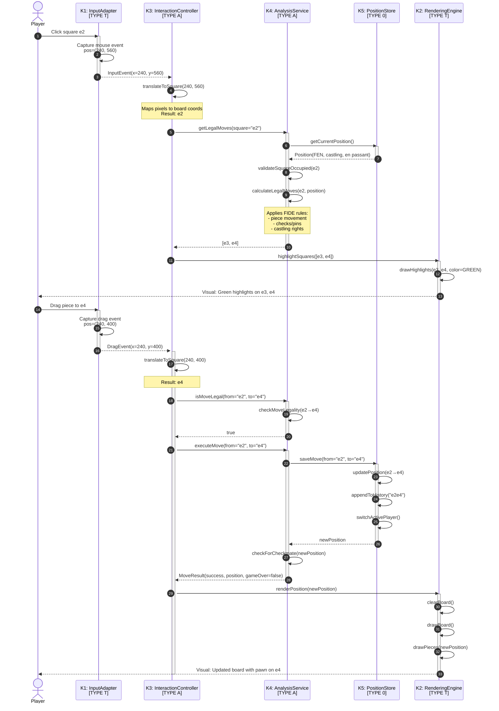
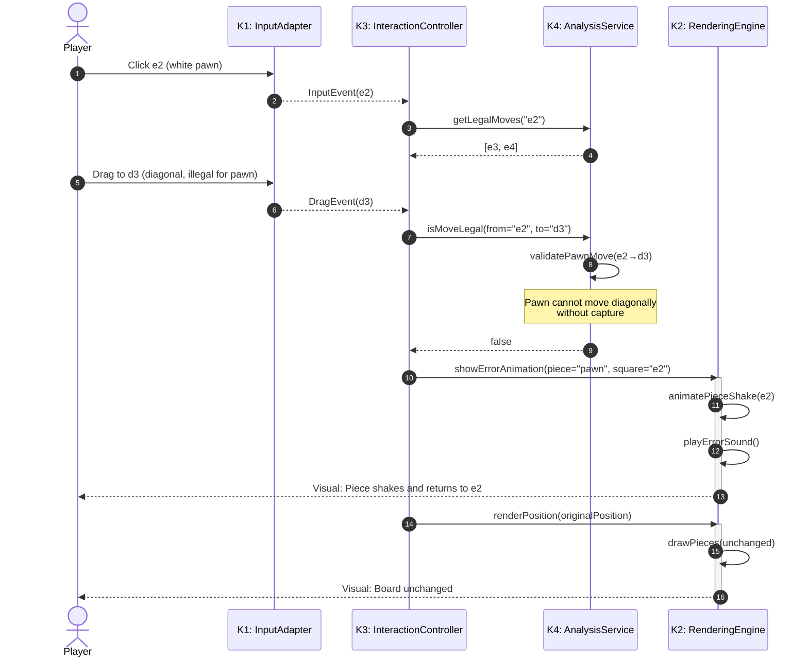
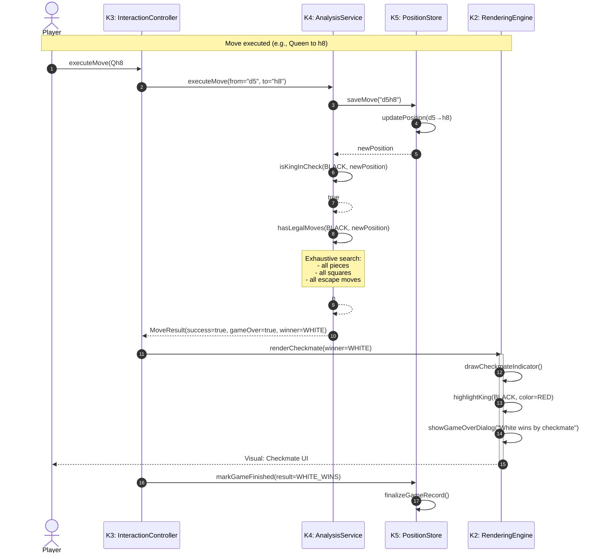
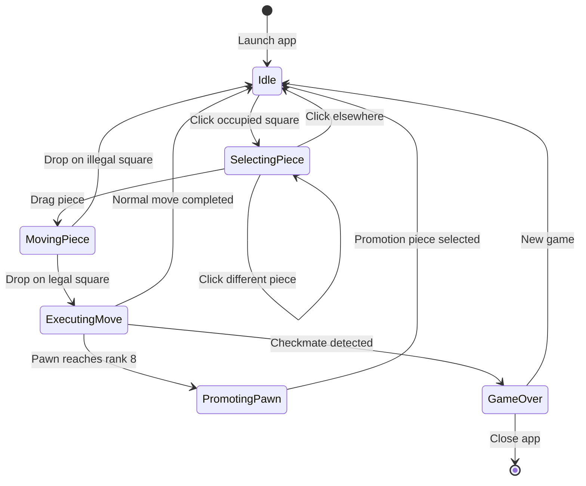

# arc42 Chapter 6: Runtime View

## Purpose

This chapter shows MateMate's dynamic behavior through concrete use case scenarios, illustrating how subsystems
cooperate at runtime.

---

## Use Case: Execute Move

**Primary Scenario:** Player selects and moves a piece on the chess board.

### Sequence Diagram



### Data Flow

| Step  | From → To    | Data              | Format                               |
|-------|--------------|-------------------|--------------------------------------|
| 1-2   | Player → K1  | Mouse click       | (x, y) pixels                        |
| 3     | K1 → K3      | Input event       | `InputEvent{x: int, y: int}`         |
| 4     | K3 internal  | Pixel to board    | `Square{file: char, rank: int}`      |
| 5-7   | K3 → K4 → K5 | Position query    | `string square`                      |
| 8-9   | K5 → K4      | Current state     | `Position{fen, castling, enPassant}` |
| 10-11 | K4 → K3      | Legal squares     | `List<Square>`                       |
| 12-13 | K3 → K2      | Highlight request | `List<Square>`                       |
| 14-16 | Player → K1  | Mouse drag        | (x, y) pixels                        |
| 17-19 | K3 → K4      | Move validation   | `Move{from, to}`                     |
| 20-25 | K4 → K5      | State update      | `Move{from, to}`                     |
| 26-28 | K2 → Player  | Visual feedback   | Rendered pixels                      |

### Timing Characteristics

| Operation                               | P50 Latency | P95 Latency | Bottleneck        |
|-----------------------------------------|-------------|-------------|-------------------|
| **Input capture** (steps 1-3)           | 2ms         | 5ms         | OS event queue    |
| **Pixel to square** (step 4)            | < 1ms       | 1ms         | Simple arithmetic |
| **Legal move calculation** (steps 5-11) | 15ms        | 40ms        | K4 rule engine    |
| **Highlight rendering** (steps 12-13)   | 8ms         | 15ms        | K2 graphics API   |
| **Move validation** (steps 17-19)       | 3ms         | 8ms         | K4 lookup         |
| **Position update** (steps 20-25)       | 5ms         | 12ms        | K5 FEN parsing    |
| **Board rendering** (steps 26-28)       | 12ms        | 18ms        | K2 sprite drawing |
| **Total end-to-end**                    | 45ms        | 100ms       | K4 analysis       |

**Performance Budget:** < 150ms (P95) for responsive UX

---

## Alternative Flow: Illegal Move Attempt

**Scenario:** Player tries to move piece to illegal square.



**Error Handling:**

- Invalid move detected at step 9 (K4 validation)
- User feedback provided immediately (steps 10-12)
- No state change persisted (K5 not called)
- Board rendered unchanged (steps 13-14)

---

## Use Case: Checkmate Detection

**Scenario:** Player delivers checkmate.



**Critical Path:**

- Steps 8-10: Checkmate detection (most expensive operation)
- Complexity: O(n×m) where n=pieces, m=possible squares
- Typical duration: 150-300ms for endgame positions

---

## State Machine: Game Flow



**State Descriptions:**

| State              | Subsystem  | Responsibility     | Duration          |
|--------------------|------------|--------------------|-------------------|
| **Idle**           | K3         | Wait for input     | Indefinite        |
| **SelectingPiece** | K3, K4     | Show legal moves   | 10-50ms           |
| **MovingPiece**    | K1, K3     | Track drag         | Real-time         |
| **ExecutingMove**  | K3, K4, K5 | Validate + persist | 20-80ms           |
| **PromotingPawn**  | K3, K2     | Show promotion UI  | User-dependent    |
| **GameOver**       | K3, K2     | Display result     | Until user action |

---

## Concurrency Model

MateMate is **single-threaded** with **event-driven** architecture.

```
Main Thread (Game Loop):
┌────────────────────────────────────┐
│ 1. Poll K1 for input events        │ ← K1: InputAdapter
│ 2. Process events via K3            │ ← K3: InteractionController
│ 3. Update game state via K4, K5     │ ← K4, K5: Logic + State
│ 4. Render frame via K2              │ ← K2: RenderingEngine
│ 5. Sleep to maintain 60 FPS         │
└────────────────────────────────────┘
         │
         └─ Loop forever
```

**No concurrency issues:**

- No shared mutable state between threads
- All operations execute sequentially
- Deterministic execution order

**Performance implications:**

- Long K4 analysis (e.g., deep search) blocks rendering
- Mitigation: Analysis limited to < 100ms per move

---

## Data Format Examples

### Position (FEN)

```
rnbqkbnr/pppppppp/8/8/8/8/PPPPPPPP/RNBQKBNR w KQkq - 0 1
│        │        │ │ │    │ │ │  └─ Fullmove number
│        │        │ │ │    │ │ └──── Halfmove clock (50-move rule)
│        │        │ │ │    │ └────── En passant target square
│        │        │ │ │    └──────── Castling rights (K=white kingside, etc.)
│        │        │ │ └───────────── Active color (w/b)
│        │        │ └─────────────── Empty squares (number)
│        │        └───────────────── Rank 3-6
│        └────────────────────────── Rank 2
└─────────────────────────────────── Rank 8 (black pieces)
```

### InputEvent

```typescript
interface InputEvent {
    type: "CLICK" | "DRAG" | "RELEASE";
    x: number;        // Pixel x-coordinate
    y: number;        // Pixel y-coordinate
    timestamp: number; // Milliseconds since app start
}
```

### Move

```typescript
interface Move {
    from: Square;      // e.g., {file: 'e', rank: 2}
    to: Square;        // e.g., {file: 'e', rank: 4}
    piece: Piece;      // PAWN, KNIGHT, etc.
    captured?: Piece;  // Optional if capture
    promotion?: Piece; // Optional for pawn promotion
}
```

---

## Performance Profile

### Move Execution Breakdown

```
Total: 45ms (P50)
├── Input capture: 2ms (4%)
├── Square translation: <1ms (2%)
├── Legal move calculation: 15ms (33%)  ← Bottleneck
├── Highlight rendering: 8ms (18%)
├── Move validation: 3ms (7%)
├── Position update: 5ms (11%)
└── Board rendering: 12ms (27%)
```

**Optimization Opportunities:**

1. Cache legal moves per position (reduces 15ms → 2ms for repeated queries)
2. Incremental rendering (only redraw changed squares)
3. GPU-accelerated sprite drawing

---

## Error Scenarios

### 1. Invalid Square (Off-Board)

**Trigger:** User clicks outside board bounds
**Detection:** K3 `translateToSquare()` returns null
**Handling:** Ignore event, no visual feedback

### 2. Empty Square Selection

**Trigger:** User clicks empty square
**Detection:** K4 `getLegalMoves()` called on empty square
**Handling:** K4 returns empty list, no highlights shown

### 3. Opponent's Piece Selection

**Trigger:** White player clicks black piece
**Detection:** K4 validates piece color vs. active player
**Handling:** K4 returns empty list (no legal moves for opponent's piece)

### 4. Position Corruption

**Trigger:** Invalid FEN in K5 (e.g., two kings of same color)
**Detection:** K5 FEN parser throws exception
**Handling:** Reject position, revert to last valid state

---

## Summary

**Key Characteristics:**

- **Synchronous:** All operations execute sequentially
- **Event-driven:** User input drives all state changes
- **Stateless UI:** K2 renders from K5 state, no UI state
- **Fail-fast:** Validation at K4 prevents invalid state in K5
- **Separation:** TYPE T (K1, K2) handles I/O, TYPE A/0 (K3, K4, K5) handles logic

**Latency Targets (Design):**

- Move execution: P95 ≤ 100ms
- Checkmate detection: P95 ≤ 300ms
- Frame rate: ≥ 60 FPS (16.67ms per frame)

**Reliability Targets:**

- Zero crashes during 100 continuous games
- 100% illegal-move rejection
- 100% FIDE-compliant checkmate detection

_Status: Targets defined for future measurement (no benchmarks executed yet)._
