# Metamodel: Architectural Concepts and Relationships

## Purpose

This document explicitly defines all architectural concepts used in MateMate documentation, their relationships, and
their semantics. This metamodel provides the vocabulary for understanding the architecture.

---

## Core Concepts

### 1. Subsystem

**Definition:** A deployable, cohesive unit of software with clear boundaries and responsibilities.

**Properties:**

- **ID:** Unique identifier (e.g., K1, K2, K3, K4, K5)
- **Name:** Human-readable label (e.g., InputAdapter, RenderingEngine)
- **Blood Type:** Classification (T, A, or 0)
- **LOC:** Lines of code
- **Services:** Number of services provided
- **Dependencies:** List of other subsystems this one depends on

**Example:**

```
K4: AnalysisService
├── Blood Type: A (Application)
├── LOC: ~2,500
├── Services: 6 (GetLegalMoves, IsMoveLegal, IsCheckmate, etc.)
└── Dependencies: [K5]
```

**Notation:**


---

### 2. Service

**Definition:** A specific capability provided by a subsystem, answerable as a question.

**Properties:**

- **ID:** Numeric identifier (1-20)
- **Question:** Natural language query (e.g., "Whose turn is it to move?")
- **Owner:** Subsystem that provides this service
- **Parameters:** Inputs required
- **Returns:** Output type

**Example:**

```
Service #9: "Whose turn is it to move?"
├── Owner: K5 (PositionStore)
├── Parameters: None
└── Returns: Color (WHITE or BLACK)
```

**Design Rule:** Each service owned by **exactly one** subsystem (no shared ownership).

---

### 3. Blood Type

**Definition:** Classification of subsystem by its primary change driver.

**Types:**

**TYPE T (Technical):**

- **Change Driver:** Technology evolution
- **Examples:** Operating system APIs, graphics libraries, input devices
- **MateMate Instances:** K1 (InputAdapter), K2 (RenderingEngine)
- **Color:** 🟦 Blue

**TYPE A (Application):**

- **Change Driver:** Business rules / domain logic
- **Examples:** Game flow, chess rules, validation logic
- **MateMate Instances:** K3 (InteractionController), K4 (AnalysisService)
- **Color:** 🟪 Purple

**TYPE 0 (Core):**

- **Change Driver:** Universal concepts (rarely change)
- **Examples:** Fundamental data structures, mathematical constants
- **MateMate Instances:** K5 (PositionStore)
- **Color:** 🟧 Orange

**Dependency Rules:**

- **Rule 1:** TYPE T MUST NOT depend on TYPE A or TYPE 0
- **Rule 2:** TYPE A MAY depend on TYPE T and TYPE 0
- **Rule 3:** TYPE 0 MUST NOT depend on anything

**Why These Rules?**

- Prevents stable code from depending on unstable code
- Enables technology replacement without touching business logic
- Ensures core concepts remain pure

---

### 4. Dependency

**Definition:** A subsystem requires functionality from another subsystem.

**Types:**

**Compile-Time Dependency (Solid Arrow):**

```csharp
// K3 depends on K4 (compile-time)
public class InteractionController
{
    private readonly IAnalysisService _analysisService; // K4 interface
}
```

- **Visual:** Solid arrow (→)
- **Binding:** Compile-time (explicit import/using)

**Runtime Dependency (Dashed Arrow):**

```csharp
// K1 sends events to K3 (runtime)
public class InputAdapter
{
    public event EventHandler<InputEvent> InputReceived;
}
```

- **Visual:** Dashed arrow (⇢)
- **Binding:** Runtime (events, callbacks, pub/sub)

**Forbidden Dependency (Red Arrow):**

- **Visual:** Red arrow with ❌
- **Meaning:** Dependency violates Allowed-to-Use Matrix

---

### 5. Allowed-to-Use Matrix

**Definition:** Binary permission matrix specifying which dependencies are architecturally allowed.

**Format:** Rows = dependents, Columns = dependencies

**Example:**
| | K1 | K2 | K3 | K4 | K5 |
|-----|----|----|----|----|-----|
| **K1** | — | ✗ | ✗ | ✗ | ✗ |
| **K2** | ✗ | — | ✗ | ✗ | ✗ |
| **K3** | ✓ | ✓ | — | ✓ | ✗ |
| **K4** | ✗ | ✗ | ✗ | — | ✓ |
| **K5** | ✗ | ✗ | ✗ | ✗ | — |

**Interpretation:**

- ✓ = Dependency allowed
- ✗ = Dependency forbidden
- — = Self-reference (N/A)

**Verification:** Can be automated (static analysis of imports).

---

### 6. Change Impact

**Definition:** Measure of how many subsystems are affected when a specific change scenario occurs.

**Notation:**

- 🟩 **Green (✗):** No impact - Subsystem untouched
- 🟨 **Yellow (✓):** Medium impact - Minor changes needed
- 🟥 **Red (✓✓):** High impact - Component requires rework

**Example Scenario:**
| Scenario: Renderer swap | K1 | K2 | K3 | K4 | K5 |
|-------------------------|----|----|----|----|-----|
| Impact | 🟩 | 🟥 | 🟨 | 🟩 | 🟩 |
| Effort | 0h | 60h | 20h | 0h | 0h |

---

### 7. Quality Attribute

**Definition:** Non-functional requirement that specifies how well the system performs its functions.

**ISO 25010 Categories:**

- **Maintainability:** How easy to modify
- **Correctness:** How accurate
- **Performance:** How fast/efficient
- **Usability:** How easy to use
- **Reliability:** How stable

**MateMate Focus:** Maintainability, Correctness, Performance (see Quality Tree in arc42 Ch10)

---

### 8. Architecture Decision Record (ADR)

**Definition:** Document capturing a significant architectural decision with context, rationale, and consequences.

**Template:**

```markdown
## ADR-XXX: Decision Title

**Date:** YYYY-MM-DD
**Status:** Accepted | Rejected | Superseded
**Deciders:** Who decided

### Context
What problem are we solving?

### Decision
What did we decide?

### Consequences
#### Positive
- ✅ Benefit 1
#### Negative
- ❌ Trade-off 1

### Alternatives Considered
1. Alternative A - Why rejected
```

**MateMate ADRs:** See arc42/09-design-decisions.md

---

## Relationships Between Concepts


---

## Subsystem Decomposition Rules

**Rule 1: Single Responsibility**

- Each subsystem has **one clear job** (expressible in one sentence)
- Example: K1 = "Capture user input events"

**Rule 2: High Cohesion**

- All services within a subsystem relate to the same concern
- Example: K4 services all relate to chess rules

**Rule 3: Low Coupling**

- Minimize dependencies between subsystems
- MateMate: Avg 3.6 dependencies per subsystem (industry avg: 8-12)

**Rule 4: Acyclic Dependencies**

- No circular dependencies allowed
- Enforced by Allowed-to-Use Matrix

**Rule 5: Blood Type Consistency**

- All services in a subsystem share the same blood type
- Example: K4 services all driven by chess rules (TYPE A)

---

## Service Allocation Rules

**Rule 1: Exclusive Ownership**

- Each service owned by exactly **one** subsystem
- No shared ownership

**Rule 2: Knowledge Encapsulation**

- Service only accessible via owner subsystem
- Example: "Whose turn is it?" → Must ask K5 (PositionStore)

**Rule 3: Interface Segregation**

- Subsystems expose only services needed by dependents
- Example: K3 doesn't expose internal coordinate conversion (private method)

---

## Visual Semantic System

### Color Encoding

| Color     | Meaning              | Example |
|-----------|----------------------|---------|
| 🟦 Blue   | TYPE T (Technical)   | K1, K2  |
| 🟪 Purple | TYPE A (Application) | K3, K4  |
| 🟧 Orange | TYPE 0 (Core)        | K5      |

**Note:** All colored diagram elements use black text for optimal readability on light backgrounds.

### Frame Style Encoding

| Style        | Meaning                                | Example          |
|--------------|----------------------------------------|------------------|
| Solid (──)   | Stable subsystem (< 5 changes/year)    | K1, K4, K5       |
| Dashed (- -) | Evolving subsystem (5-20 changes/year) | K2, K3           |
| Dotted (···) | Volatile subsystem (> 20 changes/year) | None in MateMate |
| Thick (4px)  | Security/architectural boundary        | System boundary  |

### Size Encoding

| Dimension | Meaning       | Calculation                      |
|-----------|---------------|----------------------------------|
| Width     | Lines of Code | Proportional to LOC              |
| Height    | Dependencies  | Proportional to fan-in + fan-out |

**Example:**

- K4 (2,500 LOC, 5 dependencies) → Large width, medium height
- K1 (500 LOC, 2 dependencies) → Small width, small height

### Arrow Encoding

| Style        | Meaning                        | Example                   |
|--------------|--------------------------------|---------------------------|
| Solid (→)    | Compile-time dependency        | K3 → K4 (explicit import) |
| Dashed (⇢)   | Runtime dependency             | K1 ⇢ K3 (event)           |
| 🟩 Green     | Allowed dependency             | K3 → K4 (passes matrix)   |
| 🟥 Red       | Forbidden dependency           | K1 → K4 (violates matrix) |
| Thick (3px)  | High coupling (> 10 calls)     | K3 → K4 (12 calls)        |
| Medium (2px) | Medium coupling (3-10 calls)   | K3 → K2 (5 calls)         |
| Thin (1px)   | Low coupling (1-2 calls)       | K3 → K1 (2 calls)         |

---

## Metamodel Validation

**How to verify architecture adheres to metamodel:**

1. **Subsystem Count:** 3-7 subsystems ✅ (MateMate: 5)
2. **Blood Type Distribution:** Mix of T/A/0 ✅ (2×T, 2×A, 1×0)
3. **Service Ownership:** Each service owned by exactly one ✅ (20 services, no conflicts)
4. **Dependency Rules:** Blood type rules enforced ✅ (0 violations)
5. **Allowed-to-Use Matrix:** All actual dependencies allowed ✅ (100% compliance)
6. **Visual Semantics:** Color/frame/size have meaning ✅ (documented in this metamodel)

---

## Example: Reading a Subsystem Diagram

```mermaid
graph LR
    K4["K4: AnalysisService<br/>[TYPE A]<br/>~2,500 LOC<br/>5 dependencies"]:::typeA_stable
    K5[("K5: PositionStore<br/>[TYPE 0]<br/>~600 LOC<br/>0 dependencies")]:::type0_stable

    K4 -->|"8 calls<br/>✅ Allowed"| K5

    classDef typeA_stable fill:#D9B3FF,stroke:#6A3FB2,stroke-width:2px,color:#000
    classDef type0_stable fill:#FFD699,stroke:#CC8800,stroke-width:2px,color:#000
```



**Interpretation:**

- **K4 color (purple):** TYPE A = Application subsystem (change driver: chess rules)
- **K4 frame (solid):** Stable subsystem (< 5 changes/year)
- **K4 size (large):** 2,500 LOC (largest subsystem)
- **K4 dependencies (5):** Depends on K5 only (shown), + 4 implied
- **Arrow (solid):** Compile-time dependency (K4 imports K5 interface)
- **Arrow thickness (medium):** 8 method calls (medium coupling)
- **Arrow color (implicit green):** Dependency allowed by Allowed-to-Use Matrix
- **K5 color (orange):** TYPE 0 = Core subsystem (universal concepts)
- **K5 shape (cylinder):** Data store
- **K5 dependencies (0):** No dependencies (pure core)

---

## Terminology Glossary

| Term                  | Definition                            | Example                                     |
|-----------------------|---------------------------------------|---------------------------------------------|
| **Subsystem**         | Deployable unit with clear boundaries | K1, K2, K3, K4, K5                          |
| **Service**           | Capability provided by subsystem      | "Whose turn is it?"                         |
| **Blood Type**        | Change driver classification          | T, A, 0                                     |
| **Dependency**        | Subsystem requires another            | K3 → K4                                     |
| **Allowed**           | Dependency permitted by matrix        | K3 → K4 ✅                                   |
| **Forbidden**         | Dependency violates matrix            | K1 → K4 ❌                                   |
| **Coupling**          | Strength of dependency                | Low (1-2 calls), Medium (3-10), High (> 10) |
| **Cohesion**          | Relatedness of subsystem services     | High (all relate to same concern)           |
| **Change Impact**     | Subsystems affected by scenario       | Renderer swap: K2 (high), K3 (medium)       |
| **Quality Attribute** | Non-functional requirement            | Maintainability, Correctness, Performance   |
| **ADR**               | Architecture decision record          | ADR-001, ADR-002, etc.                      |

---

## Summary

This metamodel defines **11 core concepts:**

1. Subsystem
2. Service
3. Blood Type
4. Dependency
5. Allowed-to-Use Matrix
6. Change Impact
7. Quality Attribute
8. Architecture Decision Record (ADR)
9. Visual Semantics (color/frame/size)
10. Coupling
11. Cohesion

**Why This Matters:**

- Provides common vocabulary for architecture discussions
- Makes architectural rules explicit and verifiable
- Enables automated compliance checking
- Serves as reference for new developers

**Usage:**

- When documenting: Use these concepts consistently
- When reviewing: Check adherence to metamodel rules
- When teaching: Start with metamodel to establish vocabulary
