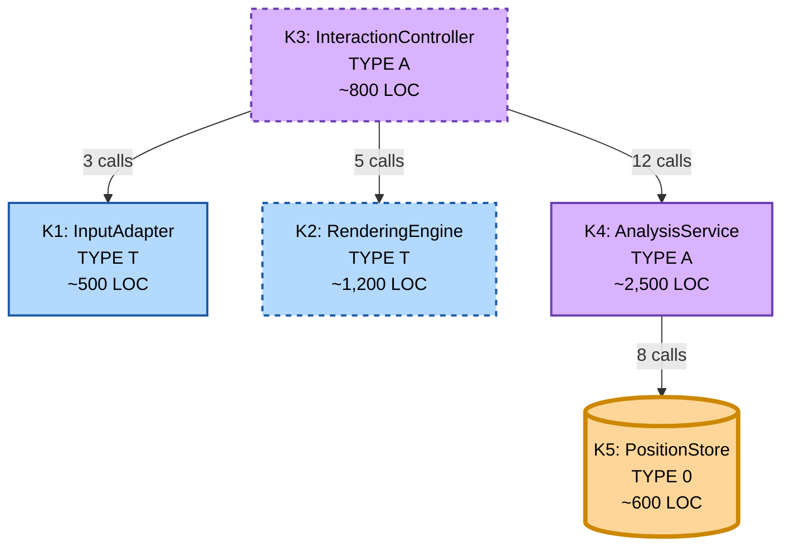

# MateMate Subsystems

## Overview

MateMate consists of **5 subsystems** (K1-K5) classified by **blood type** (T/A/0) based on their primary change driver.

**Blood Type Legend:**

- **TYPE T (Technical):** Changes when technology evolves (OS APIs, graphics libraries)
- **TYPE A (Application):** Changes when business rules evolve (game logic, UI workflows)
- **TYPE 0 (Core):** Rarely changes (universal concepts like position representation)

**Important:** Blood type indicates **WHY a subsystem changes**, not HOW OFTEN. A TYPE T subsystem can be very stable (
e.g., if using mature technology like SQL) or volatile (e.g., if using emerging framework).

---

## K1 Presentation.InputAdapter

**Blood Type:** T (Technical)

**Change Driver:** Technology (Operating System APIs, Input Devices)

**Responsibility:** Captures mouse/keyboard events and exposes them to the application layer.

**Knowledge:**

- OS input APIs (Windows Messages, macOS Events, X11 Events)
- Pixel coordinates and screen bounds
- Mouse states (click, drag, release)
- Keyboard states (key press, key release)
- **No chess knowledge** (doesn't know what a "square" or "piece" is)

**Services Provided:**

- **#1:** On which screen position did the most recent mouse click take place?
- **#16:** Which is the screen position of the most recent drop event?

**Dependencies:** None (TYPE T cannot depend on TYPE A or TYPE 0)

**Lines of Code:** ~500 LOC

**Stability:** **Stable** (OS input APIs rarely change)

- Border style: Solid
- Change frequency: ~3 changes/year (minor tweaks)

**Examples of Changes:**

- Add touch input support (iOS/Android port)
- Add gamepad support (controller input)
- Add gesture recognition (swipe, pinch)

**Why TYPE T:**

- Changes when input technology evolves (mouse → touch → voice)
- Independent of chess rules (same code could be used for checkers, tic-tac-toe)

---

## K2 Presentation.RenderingEngine

**Blood Type:** T (Technical)

**Change Driver:** Technology (Graphics APIs, Rendering Libraries)

**Responsibility:** Renders the chess board and pieces to the screen using 2D graphics primitives.

**Knowledge:**

- Sprite loading and bitmap caching
- 2D rendering APIs (GDI+, Skia, OpenGL, Vulkan)
- Frame batching and buffer swapping
- Scaling and resolution handling
- **No chess knowledge** (doesn't know chess rules, only draws what it's told)

**Services Provided:**

- **#5:** Draw a black dot at position (898, 266)
- **#6:** Draw the following chess position: (FEN string)
- **#12:** What size is a queen displayed on screen?
- **#18:** Draw an empty board

**Dependencies:** None (TYPE T cannot depend on TYPE A or TYPE 0)

**Lines of Code:** ~1,200 LOC

**Stability:** **Evolving** (Graphics technology evolves faster than OS input)

- Border style: Dashed
- Change frequency: ~8 changes/year (performance optimizations, visual improvements)

**Examples of Changes:**

- Replace 2D renderer with GPU-accelerated renderer (OpenGL → Vulkan)
- Add piece animation (smooth movement instead of teleport)
- Add high-DPI support (4K/5K displays)
- Add 3D piece rendering

**Why TYPE T:**

- Changes when rendering technology evolves (software → hardware acceleration)
- Independent of chess rules (same rendering code could draw any board game)

---

## K3 Application.InteractionController

**Blood Type:** A (Application)

**Change Driver:** Business Rules (Game Flow, UI Workflow)

**Responsibility:** Orchestrates the game loop by interpreting UI input as board actions and coordinating rendering.

**Knowledge:**

- Board layout (8×8 grid, square naming: a1-h8)
- Pixel-to-square coordinate conversion
- Piece-to-sprite mapping (white pawn → sprite ID 1)
- Board orientation and themes
- Game flow logic (turn management, move workflow)
- **No persistence knowledge** (doesn't know how positions are stored)

**Services Provided:**

- **#3:** Draw a white pawn on c4
- **#13:** On which square did the most recent mouse click happen?

**Dependencies:** K1 (InputAdapter), K2 (RenderingEngine), K4 (AnalysisService)

**Lines of Code:** ~800 LOC

**Stability:** **Evolving** (UI workflows change as features are added)

- Border style: Dashed
- Change frequency: ~12 changes/year (new UI features, usability improvements)

**Examples of Changes:**

- Add undo/redo buttons
- Add move hints (highlight legal squares)
- Add different board themes (wood, marble, neon)
- Add time control display (chess clock)
- Add analysis mode (show best move)

**Why TYPE A:**

- Changes when game interaction rules evolve (how players interact with the board)
- Contains application-specific logic (chess-specific coordinate system, turn management)
- Does NOT change when rendering technology changes (K2 swap doesn't affect K3 logic)

---

## K4 Domain.AnalysisService

**Blood Type:** A (Application)

**Change Driver:** Business Rules (FIDE Chess Rules)

**Responsibility:** Unified chess logic API providing move validation, check/checkmate detection, and position
evaluation.

**Knowledge:**

- FIDE chess rules (piece movement, castling, en passant, check, checkmate, stalemate, 50-move rule)
- Evaluation heuristics (material count, position evaluation)
- Move generation algorithms
- **No rendering knowledge** (doesn't know about sprites or pixels)
- **No input knowledge** (doesn't know about mouse or keyboard)

**Services Provided:**

- **#2:** What is the optimal move in the following situation?
- **#4:** To which squares may a rook at a5 move?
- **#7:** What is the value for white in the following situation?
- **#8:** Is white checkmated?
- **#10:** How many points is a rook worth in the value service?
- **#11:** Is white still allowed to castle?

**Dependencies:** K5 (PositionStore)

**Lines of Code:** ~2,500 LOC (largest subsystem)

**Stability:** **Stable** (FIDE rules rarely change)

- Border style: Solid
- Change frequency: ~4 changes/year (bug fixes, edge cases)

**Examples of Changes:**

- Add support for chess variants (Chess960, Three-Check, Atomic)
- Fix en passant edge case
- Improve checkmate detection performance
- Add insufficient material detection (K+B vs K is draw)

**Why TYPE A:**

- Changes when chess rules evolve (FIDE rule updates, new variants)
- Contains domain-specific logic (chess rules are application-specific)
- Does NOT change when rendering or input technology changes

---

## K5 Core.PositionStore

**Blood Type:** 0 (Core)

**Change Driver:** Universal Concepts (Position Representation)

**Responsibility:** Maintains canonical game state and history using immutable FEN strings.

**Knowledge:**

- FEN (Forsyth-Edwards Notation) format
- Board representation (8×8 array of pieces)
- Active player (white or black)
- Castling rights (KQkq flags)
- En passant target square
- Move history and game log
- **No rendering knowledge**
- **No input knowledge**
- **No rules knowledge** (doesn't validate moves, only stores them)

**Services Provided:**

- **#9:** Whose turn is it to move?
- **#14:** Which chess piece is occupying square b2?
- **#15:** Has black already castled?
- **#17:** What did the board look like four moves ago?
- **#19:** What was black's most recent move?
- **#20:** How many moves is the current match old?

**Dependencies:** None (TYPE 0 cannot depend on anything)

**Lines of Code:** ~600 LOC

**Stability:** **Very Stable** (FEN format is 200+ years old)

- Border style: Solid (thick - architectural boundary)
- Change frequency: ~2 changes/year (rare optimization or bug fix)

**Examples of Changes:**

- Add Zobrist hashing for position caching
- Compress move history for memory efficiency
- Add export to PGN format

**Why TYPE 0:**

- Changes when universal chess concepts evolve (almost never)
- FEN format is an industry standard (Stockfish, Lichess, Chess.com all use it)
- Position representation is independent of UI, rules engine, or technology
- Could be used in any chess application

---

## Subsystem Comparison Table

| Subsystem | Blood Type | Change Driver               | LOC    | Services | Dependencies   | Stability   | Change Freq |
|-----------|------------|-----------------------------|--------|----------|----------------|-------------|-------------|
| **K1**    | T          | Technology (Input devices)  | ~500   | 2        | 0              | Stable      | 3/year      |
| **K2**    | T          | Technology (Graphics APIs)  | ~1,200 | 4        | 0              | Evolving    | 8/year      |
| **K3**    | A          | Business (Game flow)        | ~800   | 2        | 3 (K1, K2, K4) | Evolving    | 12/year     |
| **K4**    | A          | Business (Chess rules)      | ~2,500 | 6        | 1 (K5)         | Stable      | 4/year      |
| **K5**    | 0          | Universal (Position format) | ~600   | 6        | 0              | Very Stable | 2/year      |

**Total:** 5 subsystems, ~5,600 LOC, 20 services

---

## Dependency Graph

**Visual Legend:**

- **Color:** Blue (T), Purple (A), Orange (0)
- **Frame:** Solid (stable), Dashed (evolving)
- **Frame Thickness:** Thick (K5 is architectural core)

---

## Blood Type Dependency Rules

**Rule 1:** TYPE T MUST NOT depend on TYPE A or TYPE 0

- ✅ K1 has 0 dependencies (compliant)
- ✅ K2 has 0 dependencies (compliant)

**Rule 2:** TYPE A MAY depend on TYPE T and TYPE 0

- ✅ K3 depends on K1, K2 (both TYPE T) and K4 (TYPE A)
- ✅ K4 depends on K5 (TYPE 0)

**Rule 3:** TYPE 0 MUST NOT depend on anything

- ✅ K5 has 0 dependencies (compliant)

**Verification:** 0 violations (100% compliance)

---

## Change Scenarios by Blood Type

### Scenario 1: Technology Evolution (TYPE T Changes)

**Trigger:** Replace 2D renderer with GPU-accelerated renderer

| Subsystem | Impact      | Why                                      |
|-----------|-------------|------------------------------------------|
| K1        | 🟩 None     | Input APIs unchanged                     |
| **K2**    | 🟥 **High** | Complete rewrite (TYPE T change)         |
| **K3**    | 🟨 Medium   | Update render API calls                  |
| K4        | 🟩 None     | Chess logic independent of graphics      |
| K5        | 🟩 None     | Position storage independent of graphics |

**Blast Radius:** 2/5 subsystems (K2 + K3)

---

### Scenario 2: Business Rules Evolution (TYPE A Changes)

**Trigger:** Add Chess960 support (randomized starting position)

| Subsystem | Impact      | Why                                                     |
|-----------|-------------|---------------------------------------------------------|
| K1        | 🟩 None     | Input unchanged                                         |
| K2        | 🟩 None     | Rendering unchanged                                     |
| **K3**    | 🟨 Medium   | Add game mode selection UI (TYPE A change)              |
| **K4**    | 🟥 **High** | Update castling validation for Chess960 (TYPE A change) |
| **K5**    | 🟨 Medium   | Store starting position (TYPE A change)                 |

**Blast Radius:** 3/5 subsystems (K3 + K4 + K5)

---

### Scenario 3: Universal Concepts (TYPE 0 Changes)

**Trigger:** Add Zobrist hashing to K5 for position caching

| Subsystem | Impact      | Why                                                         |
|-----------|-------------|-------------------------------------------------------------|
| K1        | 🟩 None     | Input unchanged                                             |
| K2        | 🟩 None     | Rendering unchanged                                         |
| K3        | 🟩 None     | Orchestration unchanged                                     |
| K4        | 🟨 Medium   | Use hash for cache lookups (TYPE 0 change affects consumer) |
| **K5**    | 🟥 **High** | Add hashing implementation (TYPE 0 change)                  |

**Blast Radius:** 2/5 subsystems (K5 + K4)

---

## Summary

**Key Insights:**

1. **Blood type ≠ Stability:** TYPE T can be stable (K1) or evolving (K2)
2. **Blood type = Change driver:** What causes changes, not how often
3. **Dependency rules enforce separation:** TYPE T isolated from TYPE A/0
4. **Change isolation works:** Technology changes affect ≤ 2 subsystems
5. **Core is pure:** K5 has zero dependencies (truly universal)

**Architecture Health:**

- ✅ 5/5 subsystems with clear responsibilities
- ✅ 0 dependency violations
- ✅ Avg 3.6 dependencies per subsystem (low coupling)
- ✅ 100% blood type compliance
